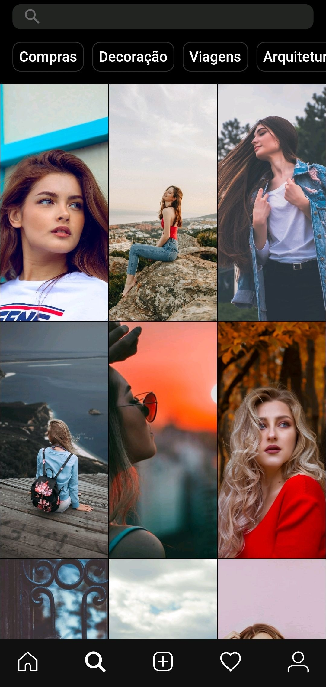

# Insta Clone

A new Flutter project.

## Getting Started

This project is a starting point for a Flutter application.

A few resources to get you started if this is your first Flutter project:

- [Lab: Write your first Flutter app](https://flutter.dev/docs/get-started/codelab)
- [Cookbook: Useful Flutter samples](https://flutter.dev/docs/cookbook)

For help getting started with Flutter, view our
[online documentation](https://flutter.dev/docs), which offers tutorials,
samples, guidance on mobile development, and a full API reference.

## Devops
- Ítalo Covas 
- Ana Clara
- Eduardo Mattos 

## Page Login

## Page Home

## Page Chat

## Page Search

## Page Activity

## Page Profile

